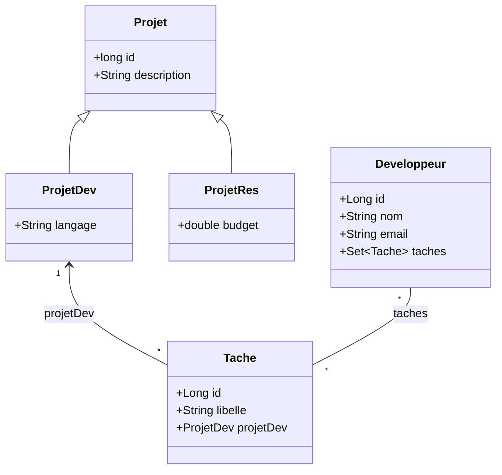
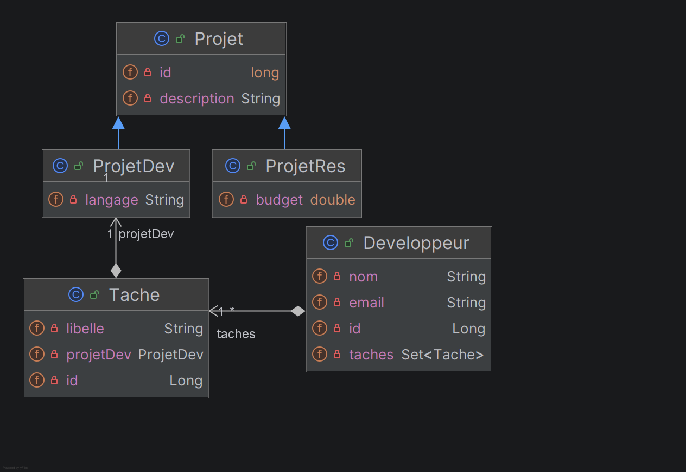

# API REST Spring Boot + Serveur MCP

Application Spring Boot de gestion de projets, tâches et développeurs.
Le projet expose deux interfaces complémentaires :

- une API REST pour les clients HTTP classiques ;
- un serveur MCP pour les clients IA.

## 1. Vue d'ensemble

Architecture en couches :

- `controller/` : points d'accès REST ;
- `mcp/` : outils MCP exposés via `@McpTool` ;
- `service/` : logique métier ;
- `repository/` : accès à la base de données ;
- `model/` : entités JPA.

L'API REST et MCP utilisent les mêmes services métier.

## 2. Modèle de données

Diagramme des relations entre les entités JPA :



Diagramme UML  :



Relations clés :
- **Projet** : classe parente avec héritage JPA (JOINED)
  - **ProjetDev** : projet de développement (ajoute `langage`)
  - **ProjetRes** : projet de recherche (ajoute `budget`)
- **Tache** : liée à **ProjetDev** en ManyToOne
- **Developpeur** : lié à **Tache** en ManyToMany (table `developpeur_tache`)

## 3. Prérequis

- **Java** : version 25 (définie dans `pom.xml`)
- **Base de données** : MySQL (locale ou distance, configurable dans `application.properties`)
- **Node.js** : version 18+ (requis uniquement pour MCP Inspector)

## 4. Configuration

Fichier : `application.properties`

Configuration de la base de données :

- `spring.datasource.url=jdbc:mysql://localhost:3306/atelier1_db5?createDatabaseIfNotExist=true`
- `spring.datasource.username=root`
- `spring.datasource.password=root`
- `spring.jpa.hibernate.ddl-auto=update`

Configuration MCP :

- `spring.ai.mcp.server.name=Atelier1 MCP Server`
- `spring.ai.mcp.server.protocol=STREAMABLE`
- `spring.ai.mcp.server.streamable-http.mcp-endpoint=/mcp`

## 5. Démarrage

Le démarrage peut être fait depuis l'IDE (via l'exécution de `Atelier1Application.java`) ou en ligne de commande.

L'application démarre par défaut sur `http://localhost:8080`.

### Depuis la ligne de commande

```powershell
.\mvnw spring-boot:run
```

## 6. Comprendre le protocole MCP

**MCP (Model Context Protocol)** est un protocole standardisé pour l'échange entre clients et serveurs :

- **Protocole** : JSON-RPC 2.0 sur HTTP/WebSocket
- **Transports** : Streamable HTTP (défaut pour ce serveur), stdio, SSE
- **Flux** : sans état, basé sur requête/réponse

Le serveur MCP de ce projet expose :
- Endpoint HTTP : `http://localhost:8080/mcp`
- Transport : `Streamable HTTP` (compatible avec la SDK Python MCP)

## 7. API REST (Spring Boot)

Contrôleurs REST :

- `controller/ProjetController.java`
- `controller/DevController.java`

Routes principales :

- `GET /projets`
- `GET /projets/{id}`
- `GET /projets/dev`
- `GET /projets/res`
- `POST /projets`
- `POST /projets/dev`
- `POST /projets/res`
- `POST /projets/{idProjet}/taches`
- `GET /projets/{idProjet}/taches`
- `GET /projets/{idProjet}/devs`
- `GET /devs`
- `GET /devs/{id}`
- `GET /devs/email/{email}`
- `GET /devs/projet/{idProjet}`
- `POST /devs`
- `POST /devs/{idDev}/{idTache}`

### Documentation Swagger UI

Documentation interactive de l'API :

- URL : `http://localhost:8080/swagger-ui/index.html`
- OpenAPI JSON : `http://localhost:8080/v3/api-docs`

**Dépendance utilisée** :

```xml
<dependency>
    <groupId>org.springdoc</groupId>
    <artifactId>springdoc-openapi-starter-webmvc-ui</artifactId>
    <version>3.0.3</version>
</dependency>
```

## 8. Serveur MCP

### 7.1. Dépendances MCP

Le serveur MCP est fourni par Spring AI. Dépendances dans `pom.xml` :

```xml
<!-- Spring AI MCP Server (WebMVC) -->
<dependency>
    <groupId>org.springframework.ai</groupId>
    <artifactId>spring-ai-starter-mcp-server-webmvc</artifactId>
</dependency>

<!-- MCP Annotations (pour @McpTool, @McpArg) -->
<dependency>
    <groupId>org.springframework.ai</groupId>
    <artifactId>spring-ai-mcp-annotations</artifactId>
</dependency>
```

### 7.2. Créer un outil MCP

Pour créer un outil MCP exposable au client, utiliser l'annotation `@McpTool` :

1. **Créer une classe service** (ex : `MyMcpTools.java`)

```java
package spring.ateliers.g5.atelier1.mcp;

import org.springframework.ai.mcp.annotation.McpArg;
import org.springframework.ai.mcp.annotation.McpTool;
import org.springframework.stereotype.Service;

@Service
public class MyMcpTools {

    // Outil sans paramètres
    @McpTool(name = "getStatus", description = "Retourne le statut du serveur")
    public String getStatus() {
        return "Le serveur est en ligne";
    }

    // Outil avec paramètres et annotations
    @McpTool(name = "greet", description = "Salue une personne par son nom")
    public String greet(
            @McpArg(name = "firstName", description = "Prénom", required = true) String firstName,
            @McpArg(name = "lastName", description = "Nom de famille", required = false) String lastName) {
        String fullName = lastName != null ? firstName + " " + lastName : firstName;
        return "Bonjour, " + fullName + " !";
    }
}
```

2. **Annoter chaque méthode à exposer** avec `@McpTool`
   - `name` : nom unique du tool (requis)
   - `description` : description pour le client IA (requis)
   - Paramètres : utiliser `@McpArg(name, description, required)`

L'outil est automatiquement enregistré et disponible sur l'endpoint MCP : `http://localhost:8080/mcp`

### 7.3. Points d'accès MCP

Endpoint MCP :

- `http://localhost:8080/mcp`

### 7.4. Outils exposés

#### Projets / Tâches (`ProjetMcpTools`)

- `lesProjets`
- `getProjetsDev`
- `getProjetsRes`
- `findProjetById`
- `ajouterProjetDev(description, langage)`
- `ajouterProjetRes(description, budget)`
- `ajouterTache(idProjet, libelle)`
- `getTaches(idProjet)`
- `getDeveloppeursAffectes(idProjet)`

#### Développeurs (`DevMcpTools`)

- `getDevs`
- `getDeveloppeur(idDev)`
- `getDeveloppeurByEmail(email)`
- `getDevsByProjet(idProjet)`
- `ajouterDeveloppeur(nom, email)`
- `affecterTache(idDev, idTache)`

## 9. VS Code + GitHub Copilot Chat

Le serveur MCP peut être ajouté en mode HTTP dans la configuration MCP de VS Code, en pointant vers :

- `http://localhost:8080/mcp`

Configuration typique (fichier `mcp.json` généré interactivement dans VS Code) :

```json
"my-mcp-server-xyz": {
  "url": "http://localhost:8080/mcp",
  "type": "http"
}
```

Une fois visible dans la liste des outils Copilot, les outils MCP peuvent être invoqués directement dans le chat.

**Exemple de prompt** :

```
Crée 5 développeurs : Alice, Bob, Charlie, Diana, Eve (avec emails correspondants)
```

Le client IA orchestrera les appels aux tools pour réaliser le scénario complexe.

## 10. MCP Inspector

MCP Inspector permet de tester et de déboguer les outils MCP manuellement sans IA.

### 9.1. Installation

MCP Inspector se distribue via npm. Pour l'installer globalement :

```powershell
npm install -g @modelcontextprotocol/inspector
```

Or, pour l'utiliser sans installation globale (recommandé) :

```powershell
npx @modelcontextprotocol/inspector
```

### 9.2. Démarrage

Lancer MCP Inspector (sans installation globale) :

```powershell
npx @modelcontextprotocol/inspector
```

Ou si installé globalement :

```powershell
mcp-inspector
```

Une interface web s'ouvre (ou une URL s'affiche dans le terminal).

### 9.3. Configuration Inspector

Dans l'interface Inspector Web :

1. Renseigner le transport : `Streamable HTTP` (ou `HTTP` selon la version)
2. Renseigner l'URL du serveur MCP : `http://localhost:8080/mcp`
3. Valider / Connecter

### 9.4. Vérifications recommandées

1. **Lister les outils** : bouton `List Tools` ou équivalent
2. **Tester un outil de lecture** : ex `getDevs`, `lesProjets`
3. **Tester un outil d'écriture** : ex `ajouterDeveloppeur(nom, email)`, `ajouterProjetDev(description, langage)`
4. **Vérifier la persistance** : relancer un tool de lecture pour confirmer les données créées

## 11. Notes

- L'API REST et MCP coexistent et peuvent être utilisés en parallèle selon le type de client.

## 12. Créer un client MCP Python

### 12.1. Package MCP Python

La SDK Python du protocole MCP est disponible via PyPI :

```bash
pip install mcp
```

**Documentation** : [Model Context Protocol - Python SDK](https://github.com/modelcontextprotocol/python-sdk)

### 12.2. Étapes pour créer un client

Un client MCP Python suit ce pattern :

1. **Importer la SDK** :
   ```python
   from mcp.client.session import ClientSession
   from mcp.client.streamable_http import StreamableHttpTransport
   ```

2. **Établir la connexion** (via Streamable HTTP) :
   ```python
   transport = StreamableHttpTransport("http://localhost:8080/mcp")
   async with ClientSession(transport) as session:
       result = await session.initialize()
   ```

3. **Lister les outils disponibles** :
   ```python
   tools = await session.list_tools()
   for tool in tools.tools:
       print(f"- {tool.name}: {tool.description}")
   ```

4. **Appeler un tool** :
   ```python
   response = await session.call_tool("lesProjets", {})
   print(response.content[0].text)
   ```

5. **Appeler un tool avec paramètres** :
   ```python
   response = await session.call_tool("ajouterDeveloppeur", {
       "nom": "Alice",
       "email": "alice@example.com"
   })
   ```

### 12.3. Intégration dans votre application

Pour intégrer le client MCP à votre application Python :

1. Installer la SDK MCP
2. Créer une session avec `StreamableHttpTransport`
3. Utiliser `await session.initialize()` pour établir le protocole
4. Appeler `await session.call_tool(name, args)` pour invoquer les outils

**Exemple minimal** :

```python
import asyncio
from mcp.client.session import ClientSession
from mcp.client.streamable_http import StreamableHttpTransport

async def main():
    transport = StreamableHttpTransport("http://localhost:8080/mcp")
    async with ClientSession(transport) as session:
        await session.initialize()
        # Appeler un tool
        response = await session.call_tool("lesProjets", {})
        print(response.content[0].text)

asyncio.run(main())
```

